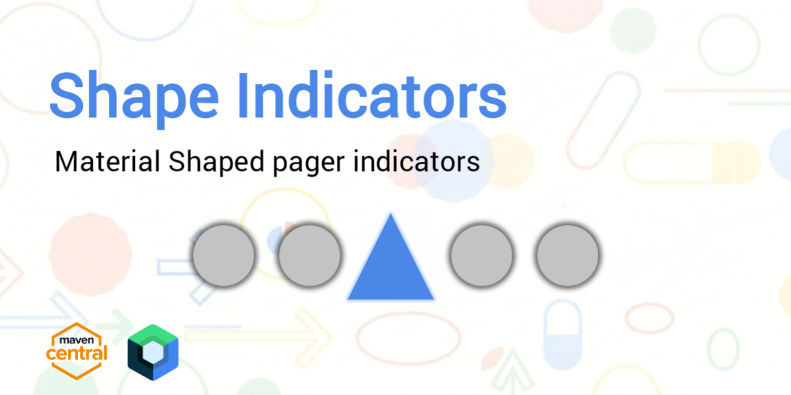

<p align="center">
  
</p>

> **Shape Indicators** is a compose library that provides access to pager indicators with elements like shape morphing.

</br>

> [!NOTE]
> Jetpack Compose UI framework required to use this library

</br>

### Usage

➤ `build.gradle`
```gradle
dependencies {
    implementation "io.github.dp-hridayan:shapeindicators:1.0.1"
}
```
</br>

➤ `build.gradle.kts`
```kotlin
dependencies {
    implementation("io.github.dp-hridayan:shapeindicators:1.0.1")
}
```
</br>

➤ TOML — `libs.versions.toml`
```toml
# libs.versions.toml
[versions]
shapeindicators = "1.0.1"
```

```toml
# libs.versions.toml
[libraries]
shapeindicators = { module = "io.github.dp-hridayan:shapeindicators", version.ref = "shapeindicators" }
```

```kotlin
// build.gradle.kts
dependencies {
    implementation(libs.shapeindicators)
}
```
## ShapeIndicatorRow — Parameters & Usage

`ShapeIndicatorRow` provides animated, morphing shape indicators for the Compose Pager.  
Below is a concise explanation of each parameter with usage examples.

---

### `pagerState: PagerState`
Required. Drives the indicator animations based on the pager’s current page and scroll offset.

```kotlin
val pagerState = rememberPagerState { 5 }

ShapeIndicatorRow(
    pagerState = pagerState
)
```

---

### `sizes: ShapeIndicatorSizes`
Controls the size of selected and unselected indicators.

Default:
```kotlin
ShapeIndicatorDefaults.sizes(
    selectedSize = 16.dp,
    unselectedSize = 10.dp
)
```

Example:
```kotlin
ShapeIndicatorRow(
    pagerState = pagerState,
    sizes = ShapeIndicatorDefaults.sizes(
        selectedSize = 22.dp,
        unselectedSize = 12.dp
    )
)
```

---

### `colors: ShapeIndicatorColors`
Defines the colors for selected and unselected indicators.

Default:
```kotlin
ShapeIndicatorDefaults.colors(
    selectedColor = MaterialTheme.colorScheme.primary,
    unselectedColor = MaterialTheme.colorScheme.surfaceVariant
)
```

Example:
```kotlin
ShapeIndicatorRow(
    pagerState = pagerState,
    colors = ShapeIndicatorDefaults.colors(
        selectedColor = Color(0xFFE54835),
        unselectedColor = Color(0xFFBDBDBD)
    )
)
```

---

### `shapes: List<RoundedPolygon>`
Specifies the target shapes the indicators morph into.

Default:
```kotlin
DefaultShapes
```

Example:
```kotlin
ShapeIndicatorRow(
    pagerState = pagerState,
    shapes = listOf(
        MaterialShapes.Pill,
        MaterialShapes.Diamond,
        MaterialShapes.SoftBurst
    )
)
```

---

### `shuffleShapes: Boolean`
If `true`, the list of shapes is shuffled once at composition to assign unique shapes to indicators.

Default:
```kotlin
shuffleShapes = false
```

Example:
```kotlin
ShapeIndicatorRow(
    pagerState = pagerState,
    shuffleShapes = true
)
```

---

### `horizontalArrangement: Arrangement.Horizontal`
Spacing between the indicators.

Default:  
```kotlin
Arrangement.SpaceBetween
```

Example:
```kotlin
ShapeIndicatorRow(
    pagerState = pagerState,
    horizontalArrangement = Arrangement.Center
)
```

---

### `verticalAlignment: Alignment.Vertical`
Vertical alignment of indicators within the row.

Default:  
```kotlin
Alignment.CenterVertically
```

Example:
```kotlin
ShapeIndicatorRow(
    pagerState = pagerState,
    verticalAlignment = Alignment.Bottom
)
```

---

### `modifier: Modifier`
Standard Compose modifier for layout, padding, width, etc.

Example:
```kotlin
ShapeIndicatorRow(
    pagerState = pagerState,
    modifier = Modifier
        .fillMaxWidth()
        .padding(12.dp)
)
```

---

## Complete Example

```kotlin
@OptIn(ExperimentalMaterial3ExpressiveApi::class)
@Composable
fun Example() {
    val pagerState = rememberPagerState { 5 }

    ShapeIndicatorRow(
        pagerState = pagerState,
        modifier = Modifier.fillMaxWidth(),
        sizes = ShapeIndicatorDefaults.sizes(
            selectedSize = 20.dp,
            unselectedSize = 12.dp
        ),
        colors = ShapeIndicatorDefaults.colors(
            selectedColor = Color.Red,
            unselectedColor = Color.Gray
        ),
        shapes = listOf(
            MaterialShapes.Cookie4Sided,
            MaterialShapes.Pill,
            MaterialShapes.Arrow
        ),
        shuffleShapes = true,
        horizontalArrangement = Arrangement.Center,
        verticalAlignment = Alignment.CenterVertically
    )
}
```
